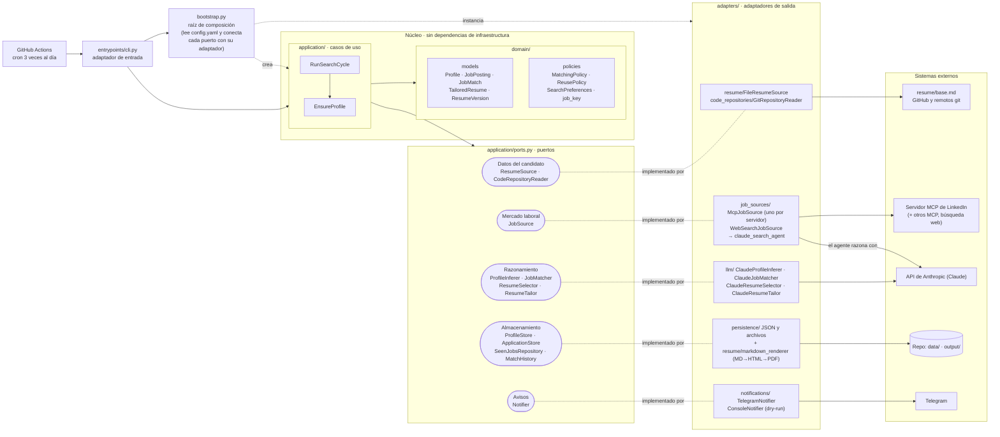
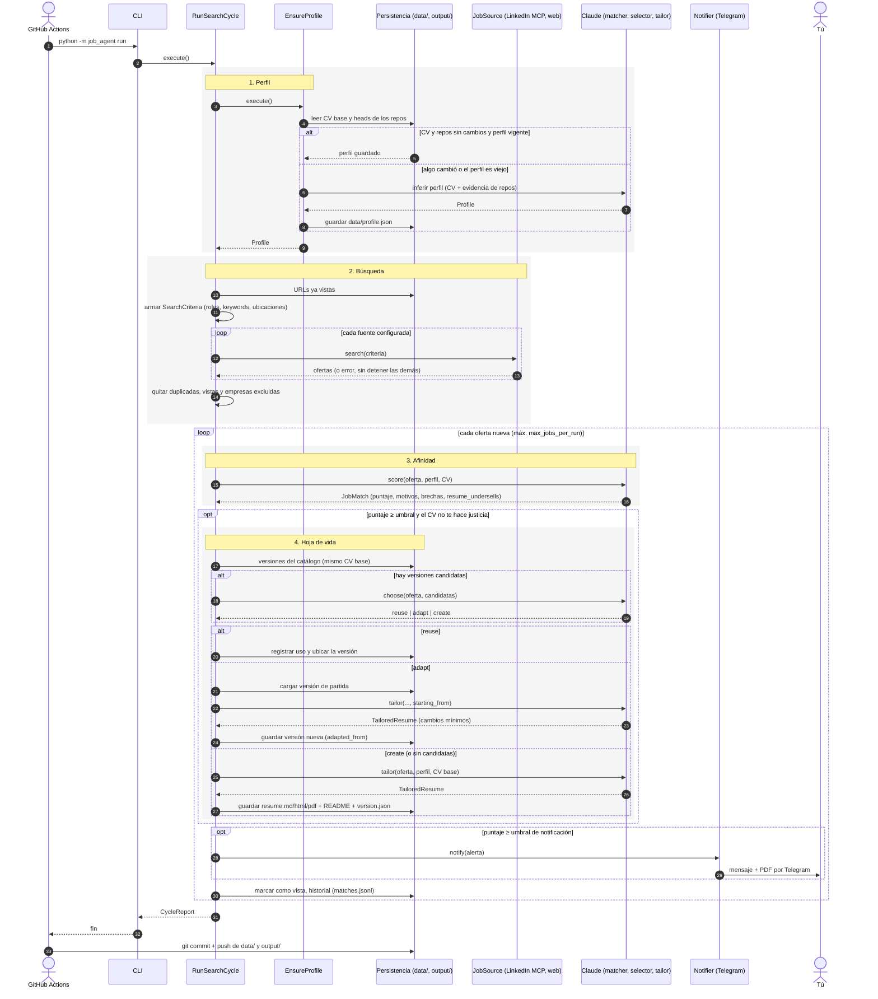
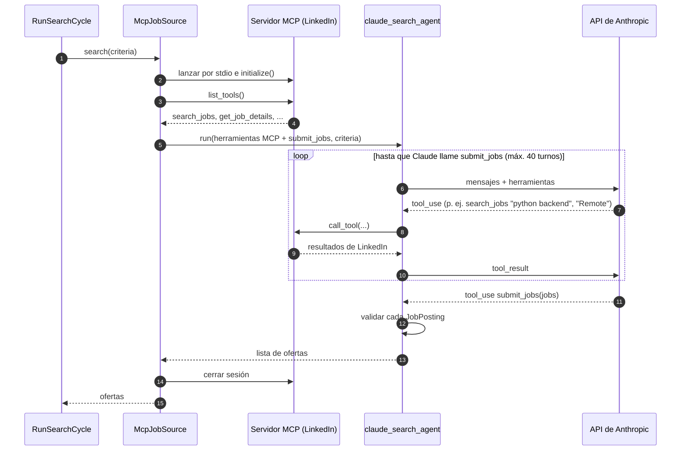

# Arquitectura del agente

Fuentes de los diagramas: `docs/diagramas/*.mmd` (Mermaid). También hay versiones PNG en la misma carpeta.

## Diagrama de componentes

Arquitectura hexagonal: los casos de uso (`application/`) y el dominio (`domain/`) solo conocen los
**puertos** (`application/ports.py`). Cada herramienta externa entra por un **adaptador** en
`adapters/`, y `bootstrap.py` decide qué adaptador implementa cada puerto.

| Puerto | Para qué lo usa el núcleo | Adaptador actual |
|---|---|---|
| `ResumeSource` | leer tu CV base | `FileResumeSource` (`resume/base.md`, .txt o .pdf) |
| `CodeRepositoryReader` | listar repos y extraer evidencia | `GitRepositoryReader` (GitHub + cualquier remoto git) |
| `ProfileInferer` | inferir el perfil | `ClaudeProfileInferer` |
| `JobSource` | buscar ofertas | `McpJobSource` (uno por servidor MCP), `WebSearchJobSource` |
| `JobMatcher` | puntuar cada oferta | `ClaudeJobMatcher` |
| `ResumeSelector` | decidir reutilizar / adaptar / crear | `ClaudeResumeSelector` |
| `ResumeTailor` | crear o adaptar la hoja de vida | `ClaudeResumeTailor` |
| `ProfileStore` | guardar el perfil | `JsonProfileStore` (`data/profile.json`) |
| `ApplicationStore` | catálogo de hojas de vida | `FileSystemApplicationStore` (`output/…/version.json`) |
| `SeenJobsRepository` | no repetir ofertas | `JsonSeenJobsRepository` (`data/state.json`) |
| `MatchHistory` | historial de puntajes | `JsonlMatchHistory` (`data/matches.jsonl`) |
| `Notifier` | avisarte | `TelegramNotifier`, `ConsoleNotifier` (dry-run) |

## Diagrama de secuencia: un ciclo completo

Lo que pasa en cada una de las 3 ejecuciones diarias (`python -m job_agent run`).

Notas:

- Los pasos 3 a 9 solo llaman a Claude cuando cambió tu CV, cambió algún repo o el perfil tiene más
  de `profile_refresh_days` días.
- Si una fuente falla (paso 13), el error queda en el reporte y las demás fuentes siguen.
- Una oferta se marca como vista solo si se pudo puntuar; si falla el puntaje, se reintenta en el
  siguiente ciclo.
- Si falla la generación de la hoja de vida, igual se envía la notificación, indicando que no se generó.

## Diagrama de secuencia: búsqueda en una fuente MCP (LinkedIn)

Detalle del paso 12 para `McpJobSource`. `WebSearchJobSource` sigue el mismo bucle, pero la
herramienta es la búsqueda web que se ejecuta en los servidores de Anthropic.

