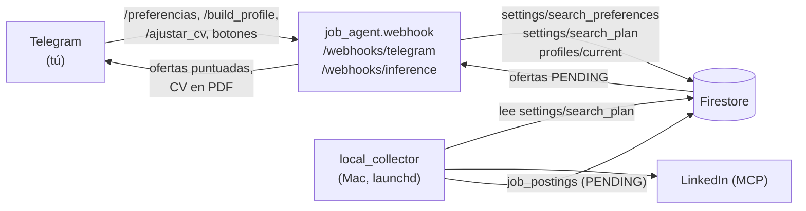
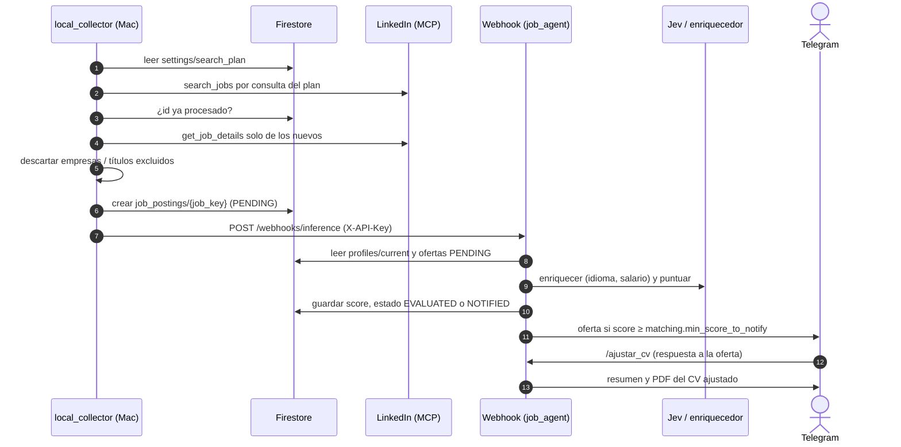

# Arquitectura

El sistema tiene dos piezas que se comunican a través de Cloud Firestore; el buscador además avisa al
servicio por HTTP cuando termina una corrida:

- **Buscador local** (`local_collector/`, en tu Mac): consulta LinkedIn con tu sesión MCP según el plan
  `settings/search_plan`, descarta lo ya visto y lo excluido, y escribe ofertas nuevas en
  `job_postings/{job_key}`. Al terminar llama a `POST /webhooks/inference` del servicio (si
  `JOB_AGENT_URL` está configurada) para que evalúe y notifique. No usa LLM ni Telegram.
- **Servicio remoto** (`job_agent/`, FastAPI en Cloud Run): puntúa las ofertas con Jev, las notifica por
  Telegram, y atiende los comandos del bot (`/build_profile`, `/resend_pending`, `/ajustar_cv`,
  `/preferencias`). `job_contracts/` contiene los modelos compartidos.

Principio: **primero lo determinista, el LLM al final**. El plan de búsqueda y los filtros son código;
el LLM solo infiere el perfil, interpreta peticiones de `/preferencias` y ajusta la hoja de vida.

## Flujo de datos

## Preferencias de búsqueda

`/preferencias` (sin texto) muestra `settings/search_preferences`. Con texto, un LLM lo traduce a
operaciones estructuradas que el código valida; el bot muestra el cambio y el plan resultante con los
botones Aplicar y Cancelar. Al aplicar, en una sola transacción se guardan las preferencias (versión + 1)
y el plan compilado `settings/search_plan`, que lleva `preferences_version`. `/build_profile` también
reconstruye el plan, porque los cargos del perfil aportan palabras clave. El buscador excluye empresas
y títulos del plan, por lo que las ofertas excluidas nunca llegan a Firestore.

## Secuencia: de la búsqueda al aviso

## Estructura del servicio (hexagonal)

`domain/` (modelos y reglas puras) y `application/` (casos de uso y `ports.py`) no conocen
infraestructura. Cada herramienta externa es un adaptador en `adapters/` detrás de un puerto:

| Puerto | Adaptador actual |
|---|---|
| `ResumeSource`, `CodeRepositoryReader` | `FileResumeSource`, `GitRepositoryReader` |
| `ProfileInferer`, `JobMatcher`, `ResumeTailor`, `PreferenceInterpreter` | `Llm*` sobre Anthropic u OpenRouter (`llm/`) |
| `ProfileStore`, `SearchSettingsStore` | `FirestoreProfileStore`, `FirestoreSearchSettingsStore` |
| Puntuación y avisos de ofertas | `scoring/` (Jev) y `TelegramOfferNotifier` |
| Envío de CV y de preferencias | `TelegramCvDelivery`, `TelegramPreferencesChat` |

`entrypoints/telegram.py` recibe las actualizaciones del bot y `webhook.py` es la raíz de composición del
servicio. La regla de dependencias se verifica en `tests/test_architecture.py`.
