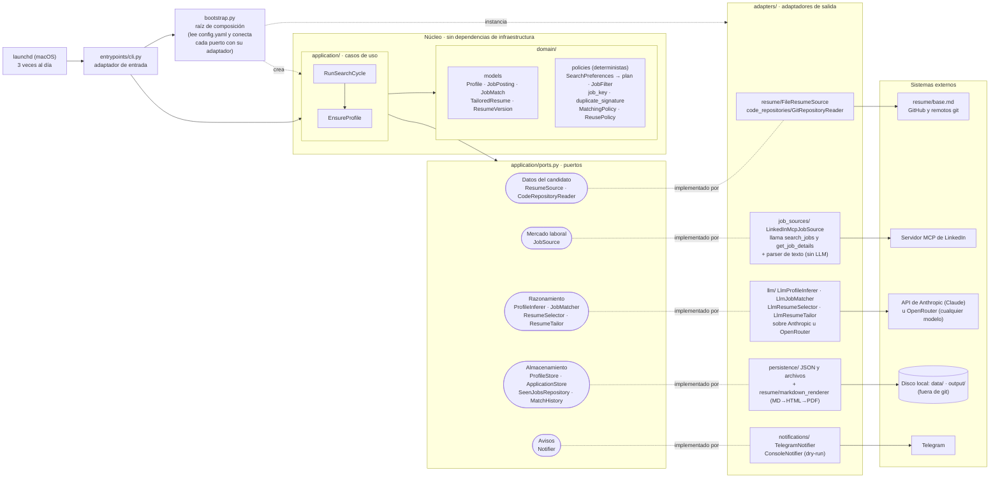
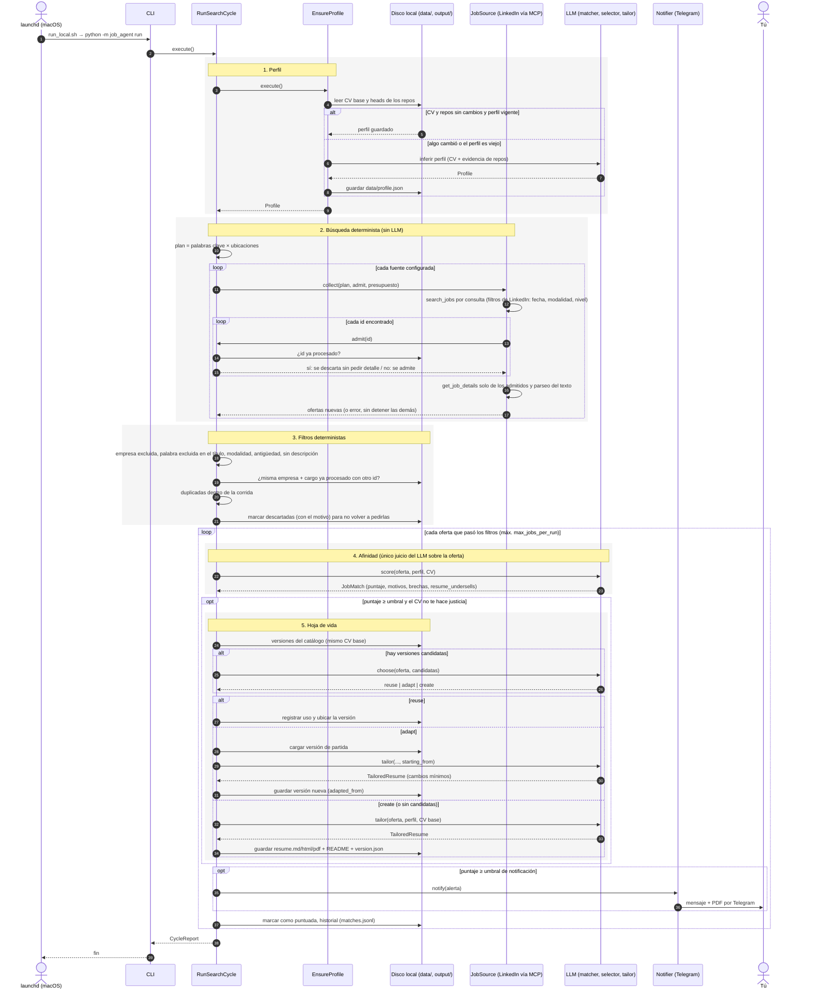
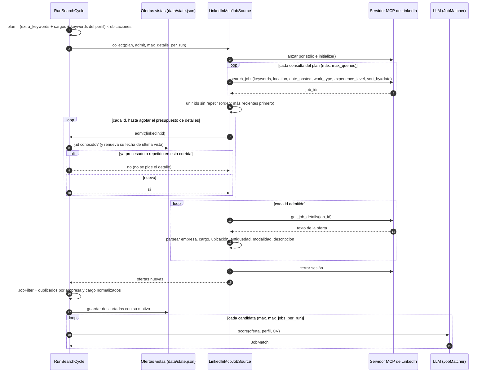

# Arquitectura del agente

Fuentes de los diagramas: `docs/diagramas/*.mmd` (Mermaid). También hay versiones PNG en la misma carpeta.

Principio: **primero lo determinista, el LLM al final**. La búsqueda y todos los filtros son código
(sin LLM); el LLM (Claude u otro modelo vía OpenRouter, según `llm` en `config.yaml`) solo evalúa el encaje de las ofertas que sobreviven y, cuando hace falta, la hoja de vida.

## Diagrama de componentes

Arquitectura hexagonal: los casos de uso (`application/`) y el dominio (`domain/`) solo conocen los
**puertos** (`application/ports.py`). Cada herramienta externa entra por un **adaptador** en
`adapters/`, y `bootstrap.py` decide qué adaptador implementa cada puerto.

| Puerto | Para qué lo usa el núcleo | Adaptador actual |
|---|---|---|
| `ResumeSource` | leer tu CV base | `FileResumeSource` (`resume/base.md`, .txt o .pdf) |
| `CodeRepositoryReader` | listar repos y extraer evidencia | `GitRepositoryReader` (GitHub + cualquier remoto git) |
| `ProfileInferer` | inferir el perfil | `LlmProfileInferer` |
| `JobSource` | buscar ofertas (determinista) | `LinkedInMcpJobSource` (herramientas del servidor MCP llamadas directamente) |
| `JobMatcher` | puntuar cada oferta | `LlmJobMatcher` |
| `ResumeSelector` | decidir reutilizar / adaptar / crear | `LlmResumeSelector` |
| `ResumeTailor` | crear o adaptar la hoja de vida | `LlmResumeTailor` |

Los cuatro adaptadores `Llm*` comparten los prompts (`adapters/llm/prompts.py`) y delegan el transporte en un
`StructuredModel`: `AnthropicStructuredModel` o `OpenRouterStructuredModel`, elegido por `llm.provider`.
| `ProfileStore` | guardar el perfil | `JsonProfileStore` (`data/profile.json`) |
| `ApplicationStore` | catálogo de hojas de vida | `FileSystemApplicationStore` (`output/…/version.json`) |
| `SeenJobsRepository` | no repetir ofertas | `JsonSeenJobsRepository` (`data/state.json`) |
| `MatchHistory` | historial de puntajes | `JsonlMatchHistory` (`data/matches.jsonl`) |
| `Notifier` | avisarte | `TelegramNotifier`, `ConsoleNotifier` (dry-run) |

## Diagrama de secuencia: un ciclo completo

Lo que pasa en cada una de las 3 ejecuciones diarias que lanza launchd en tu Mac (`scripts/macos/run_local.sh`).

Notas:

- El perfil (pasos 3 a 9) solo se recalcula con Claude cuando cambió tu CV, cambió algún repo o el
  perfil tiene más de `profile_refresh_days` días.
- Una oferta ya procesada (puntuada o descartada por un filtro) nunca se vuelve a descargar: su id se
  rechaza antes de pedir el detalle. Su fecha de "última vista" se renueva cada vez que aparece, y solo
  se olvida tras 90 días sin aparecer en ninguna búsqueda.
- Los presupuestos (`max_details_per_run`, `max_jobs_per_run`) se aplican **después** de descartar lo
  conocido, así que las ofertas repetidas no ocupan cupo.
- Si falla una fuente, una consulta o el detalle de una oferta, se registra y el resto continúa. Una
  oferta que no se pudo puntuar no se marca, y se reintenta en la siguiente corrida.

## Diagrama de secuencia: búsqueda en LinkedIn

Detalle de la búsqueda determinista con `LinkedInMcpJobSource`.

### Filtros, en orden

| Etapa | Dónde | Regla |
|---|---|---|
| 1 | LinkedIn (`search_jobs`) | antigüedad (`posted_within_days`), modalidad (`work_types`), nivel (`experience_levels`), orden por fecha |
| 2 | Agente, antes de pedir detalle | id ya procesado en corridas anteriores o repetido en esta corrida |
| 3 | Agente, sobre el detalle (`JobFilter`) | empresa excluida (normalizada: "Acme Inc." = "ACME"), palabra excluida en el título (palabra completa), modalidad no deseada, publicación antigua, sin descripción |
| 4 | Agente, sobre el detalle | misma empresa + cargo normalizados que otra oferta de esta corrida o ya procesada con otro id (reposts) |
| 5 | LLM | encaje con tu perfil: puntaje 0-100 |

El texto de cada oferta se convierte en campos con un parser determinista
(`adapters/job_sources/linkedin_text.py`). Si no reconoce el formato, deja vacíos título, empresa o
ubicación: esos filtros no se aplican a esa oferta (no se descarta por falta de datos) y, para mostrarla
en la notificación, se usa lo que Claude leyó en el texto al puntuarla.
